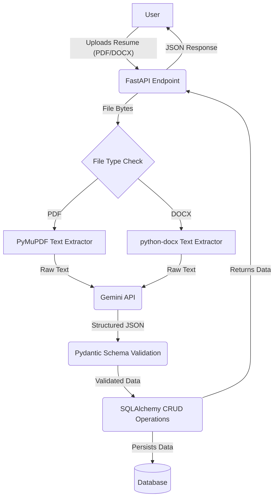

# AI Resume Parser API

An intelligent RESTful API built with FastAPI that leverages the power of Google's Gemini Pro to parse resumes from PDF and DOCX files. It extracts key information, structures it into a clean JSON format, and saves it to a database for easy retrieval and management.


## Overview

In the recruitment process, manually sifting through hundreds of resumes is a time-consuming task. This API automates the process by:

1.  Accepting resume files (`.pdf`, `.docx`) through a simple API endpoint.
2.  Extracting raw text content from the documents.
3.  Utilizing the advanced natural language understanding capabilities of the Google Gemini model to parse the text into a structured `JSON` format.
4.  Persisting the structured data in a relational database (using SQLAlchemy).
5.  Providing endpoints to create, read, search, and delete parsed resume data.

This tool is perfect for developers building Applicant Tracking Systems (ATS), HR tech platforms, or any application that needs to programmatically understand resume data.

## Features

  - **Multi-Format Support:** Handles both `PDF` and `DOCX` file uploads.
  - **AI-Powered Parsing:** Uses Google's Gemini 1.5 Flash model for high-accuracy information extraction.
  - **Structured JSON Output:** Returns clean, predictable `JSON` data based on a Pydantic schema, including personal info, skills, experience, education, and projects.
  - **Database Persistence:** Automatically saves, updates, and manages parsed resumes in a database via SQLAlchemy.
  - **Full CRUD API:** Provides endpoints to upload, retrieve by ID, search by email, list all, and delete resumes.
  - **Interactive Documentation:** Auto-generated, interactive API documentation powered by FastAPI (available at `/docs`).

## Architecture Flow

The data flow through the application is straightforward:



## Technology Stack

  - **Backend Framework:** [FastAPI](https://fastapi.tiangolo.com/)
  - **AI Language Model:** [Google Gemini API](https://ai.google.dev/)
  - **Database ORM:** [SQLAlchemy](https://www.sqlalchemy.org/)
  - **Data Validation:** [Pydantic](https://www.google.com/search?q=https://docs.pydantic.dev/)
  - **PDF Parsing:** [PyMuPDF (fitz)](https://pymupdf.readthedocs.io/en/latest/)
  - **DOCX Parsing:** [python-docx](https://python-docx.readthedocs.io/en/latest/)
  - **Environment Variables:** [python-dotenv](https://pypi.org/project/python-dotenv/)
  - **ASGI Server:** [Uvicorn](https://www.uvicorn.org/)

## Setup and Installation

### Prerequisites

  - Python 3.9+
  - Git
  - A Google Gemini API Key. You can get one from [Google AI Studio](https://makersuite.google.com/app/apikey).

### Installation Steps

1.  **Clone the repository:**

    ```bash
    git clone https://github.com/your-username/ai-resume-parser.git
    cd ai-resume-parser
    ```

2.  **Create and activate a virtual environment:**

    ```bash
    # For Windows
    python -m venv venv
    .\venv\Scripts\activate

    # For macOS/Linux
    python3 -m venv venv
    source venv/bin/activate
    ```

3.  **Install the required dependencies:**

    ```bash
    pip install -r requirements.txt
    ```


4.  **Set up environment variables:**
    Create a file named `.env` in the root directory and add your Google Gemini API key:

    ```env
    # .env
    GEMINI_API_KEY="YOUR_GEMINI_API_KEY"
    ```

5.  **Run the application:**

    ```bash
    uvicorn main:app --reload
    ```

    The API will be available at `http://127.0.0.1:8000`.

6.  **Access the documentation:**
    Navigate to `http://127.0.0.1:8000/docs` in your browser to see the interactive Swagger UI documentation.

## API Endpoints

Here are the primary endpoints available:

#### `POST /parse-resume/`

Uploads a resume file for parsing and storage.

  - **Request Body:** `multipart/form-data` with a `file` field containing the PDF or DOCX file.
  - **Success Response (200):**
    ```json
    {
      "personal_info": {
        "name": "John Doe",
        "email": "john.doe@example.com",
        "phone": "123-456-7890",
        "linkedin_url": "https://linkedin.com/in/johndoe",
        "github_url": "https://github.com/johndoe",
        "address": "123 Main St, Anytown, USA"
      },
      "summary": "A highly skilled software engineer with 5 years of experience...",
      "skills": ["Python", "FastAPI", "Docker", "JavaScript", "React"],
      "work_experience": [
        {
          "company": "Tech Solutions Inc.",
          "job_title": "Senior Software Engineer",
          "start_date": "2022-01-01",
          "end_date": "Present",
          "responsibilities": ["Led the development of a microservices-based platform..."]
        }
      ],
      "projects": [
        {
          "name": "Personal Portfolio Website",
          "description": "Developed a personal portfolio using React...",
          "technologies": ["React", "CSS", "Netlify"]
        }
      ],
      "education": [
        {
          "institution": "State University",
          "degree": "Bachelor of Science in Computer Science",
          "start_date": "2016-08-01",
          "end_date": "2020-05-01"
        }
      ]
    }
    ```

#### `GET /resumes/{resume_id}`

Retrieves a specific parsed resume by its database ID.

  - **Path Parameter:** `resume_id` (integer)
  - **Success Response (200):** The structured JSON data for the requested resume.
  - **Error Response (404):** `{"detail": "Resume not found"}`

#### `GET /resumes/search/`

Searches for a parsed resume by the candidate's email address.

  - **Query Parameter:** `email` (string)
  - **Success Response (200):** The structured JSON data for the resume associated with the email.
  - **Error Response (404):** `{"detail": "Resume not found for the provided email"}`

#### `GET /resumes/`

Retrieves a list of all parsed resumes stored in the database.

  - **Success Response (200):** An array of resume objects.

#### `DELETE /resumes/{resume_id}`

Deletes a resume from the database by its ID.

  - **Path Parameter:** `resume_id` (integer)
  - **Success Response (200):** `{"message": "Resume with ID {resume_id} has been deleted successfully"}`
  - **Error Response (404):** `{"detail": "Resume not found"}`

## Project Structure

A typical project structure for this application would be:

```
.
├── venv/                     # Virtual environment directory
├── .env                      # Environment variables (API Key)
├── .gitignore                # Git ignore file
├── crud.py                   # Database CRUD (Create, Read, Update, Delete) functions
├── database.py               # Database engine and session configuration
├── main.py                   # Main FastAPI application logic and endpoints
├── models.py                 # SQLAlchemy database models/tables
├── schemas.py                # Pydantic data schemas for validation and serialization
├── requirements.txt          # Project dependencies
└── README.md                 # This file
```

**`requirements.txt` content:**

```txt
fastapi
uvicorn[standard]
python-dotenv
google-generativeai
PyMuPDF
python-docx
SQLAlchemy
# For SQLite (default) no extra driver is needed
# For PostgreSQL, add: psycopg2-binary
```

## How to Contribute

Contributions are welcome\! If you'd like to contribute, please fork the repository and use a feature branch. Pull requests are warmly welcome.

1.  Fork the repository.
2.  Create your feature branch (`git checkout -b feature/amazing-feature`).
3.  Commit your changes (`git commit -m 'Add some amazing feature'`).
4.  Push to the branch (`git push origin feature/amazing-feature`).
5.  Open a Pull Request.

## License

This project is licensed under the MIT License. See the `LICENSE` file for more details.
